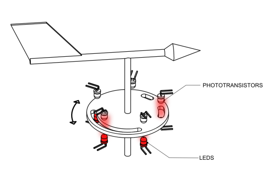
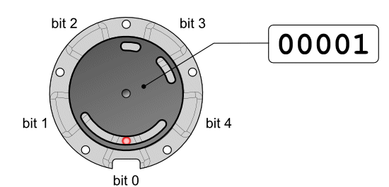
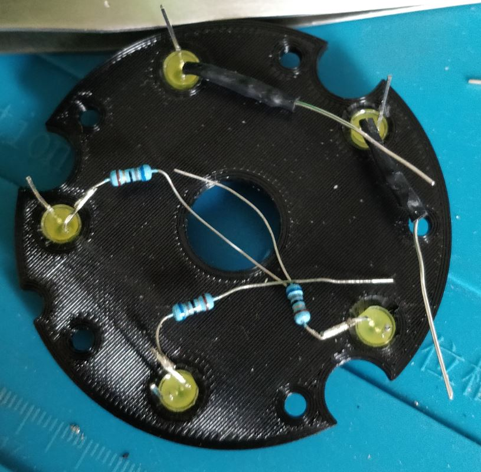
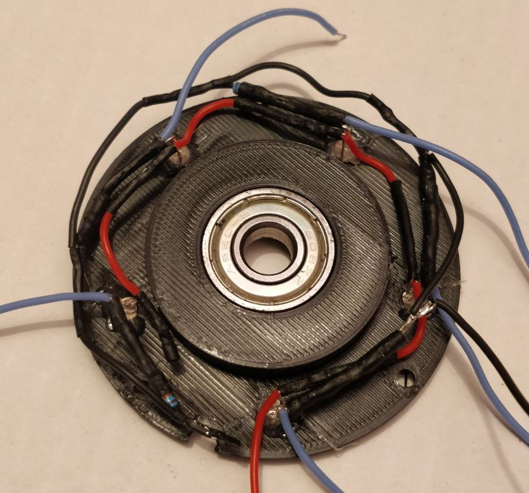
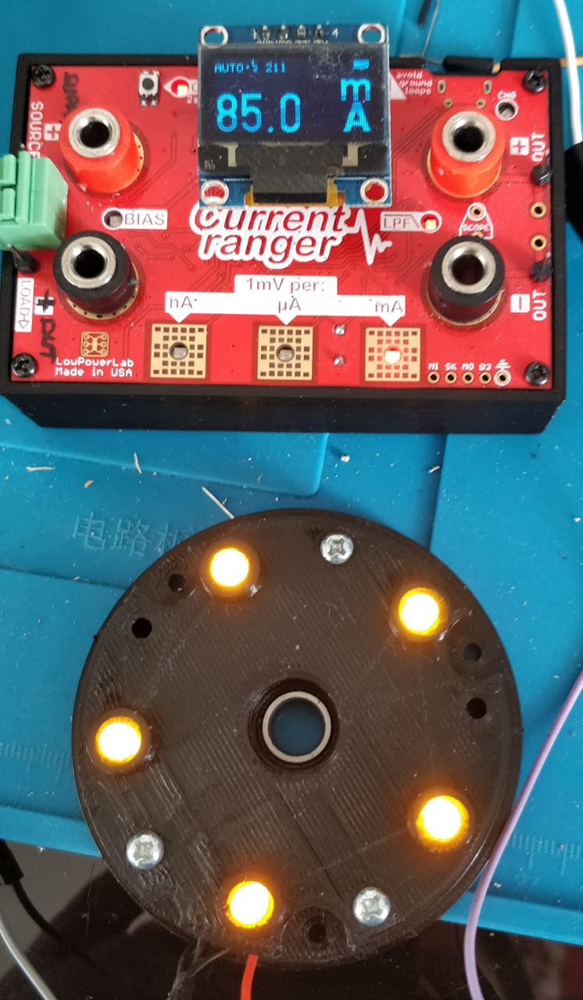
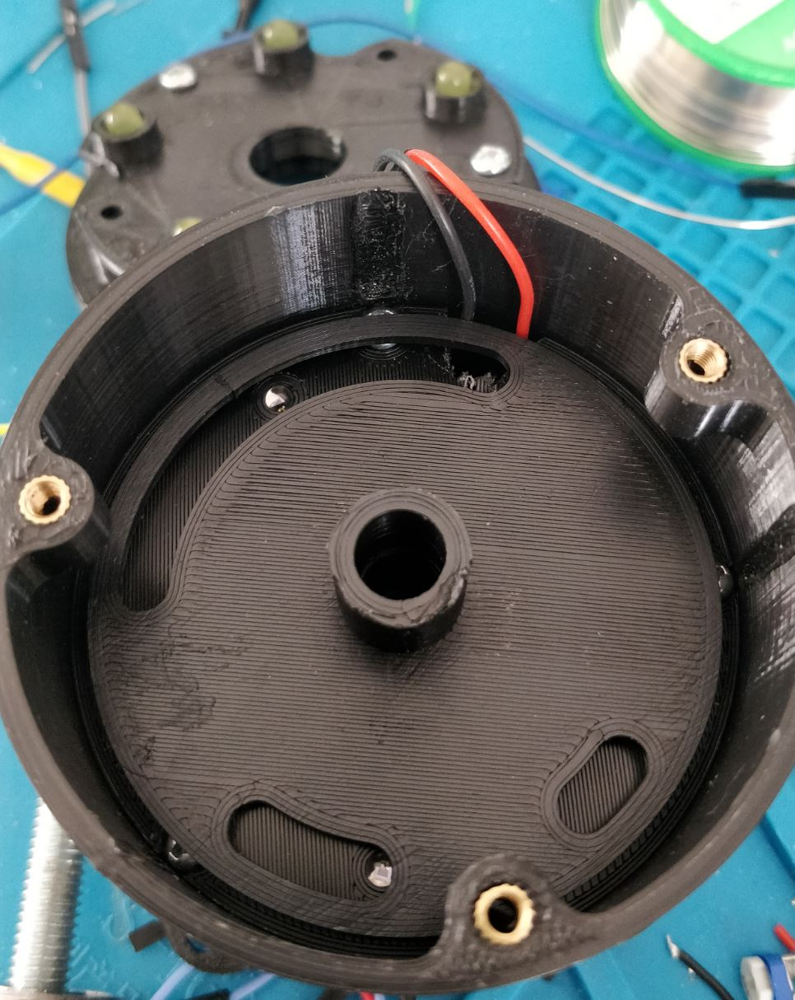
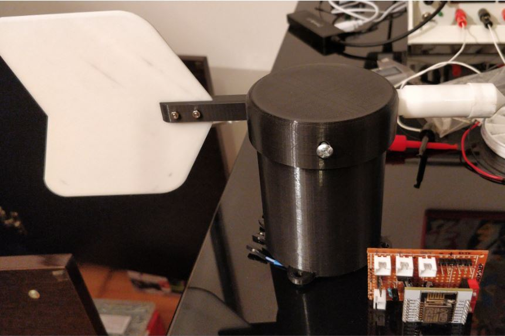

# Solar powered, waterproof, full 3d printed, optical windvane Version 2

## Foreword

This is the second version of my windvane. 

First version still available here : <https://github.com/fguiet/windvane>

This one has 2 majors improvements:

1. New waterproof top design 

Now it includes nuts and bolt to tighten the shaft very hard.

2. Use an optical method to encode 

## How it works ?

We are going to use an optical method, a perforated disk which rotates between leds and phototransistors. Each time a phototransistor is lighted by the opposite led, it becomes conductive. We associate bit 1 with the conductive state and bit 0 to the blocking state of each phototransistor.

We therefore need to arrange the phototransistors and the holes on the disk so that we can encode a maximum of positions in a minimum of space. It so happens that a given Bruce Spedding imagined a method, later improved by Alain P. Hiltgen and Kenneth G. Paterson, called "Single Track Gray Code". This method presents two noticeable features: first, generated codes differ only from one bit from one position to another. This is the principle of Gray codes, and this limits the risks of reading errors for intermediary positions. Second, the sensors are located on the same circular track, which enables us to build very compact encoders. The price to pay is that the number of codable positions is smaller than 2n. For example, with 5 phototransistors, we can encode only 30 positions. This provides a precision of 12°, which is largely enough when we need to determine wind direction. 

## Bill Of Material (BOM)

Electronic spare parts needed :

* 3.7v Lithium battery (1000 mAh)
* [Solar panel 5V, 110x69mm, 1.25W](https://fr.aliexpress.com/item/33009994951.html?spm=a2g0o.productlist.0.0.210c3a38kn2t7c&algo_pvid=b3222a7c-a624-4fac-ab55-7f40478d973e&algo_expid=b3222a7c-a624-4fac-ab55-7f40478d973e-5&btsid=0b0a187916091832689556540ec01b&ws_ab_test=searchweb0_0,searchweb201602_,searchweb201603_)
* [Lithium battery charger module TP4056](https://www.aliexpress.com/item/32797834680.html?spm=a2g0o.productlist.0.0.217e1a3fGgFPtZ&algo_pvid=132d3b0e-1179-4677-b1ea-ac7e339a4b3a&algo_expid=132d3b0e-1179-4677-b1ea-ac7e339a4b3a-0&btsid=0b0a3f8115821175486423616e1e40&ws_ab_test=searchweb0_0,searchweb201602_,searchweb201603_)
* [ESP8266 12E](https://fr.aliexpress.com/item/32324777806.html?spm=a2g0o.productlist.0.0.30dc5c6fdmjCLd&algo_pvid=1a10d522-e009-4faf-93df-d7671d7a6cb1&algo_expid=1a10d522-e009-4faf-93df-d7671d7a6cb1-15&btsid=0b0a187916091833560657384ec01b&ws_ab_test=searchweb0_0,searchweb201602_,searchweb201603_)
* Home made voltage divider with 2 resitors 51KOhm and 15kOhm
* [Solar panel](https://www.aliexpress.com/item/32327321902.html?spm=a2g0s.9042311.0.0.27424c4dXw694V)
* [XH2.54 connectors](https://www.aliexpress.com/item/32751262161.html?spm=a2g0o.productlist.0.0.73ad7920LACtrI&algo_pvid=59f4dba8-049b-412b-b6ab-2ad6a2a0b251&algo_expid=59f4dba8-049b-412b-b6ab-2ad6a2a0b251-1&btsid=0b0a01f815821181817176811e4e9d&ws_ab_test=searchweb0_0,searchweb201602_,searchweb201603_)
* [30 AWG (0.08mm) silicon wire](https://www.aliexpress.com/item/1000006501735.html?spm=a2g0s.9042311.0.0.27424c4d4oyuHy)
* [Bearing 608ZZ](https://www.aliexpress.com/wholesale?catId=0&initiative_id=SB_20200219052438&SearchText=bearing+608)
* Some resistors
* Some nuts and bolts
* 5 yellow LEDs
* [5 TEPT 4400 phototransistor](https://fr.aliexpress.com/item/32790079325.html?spm=a2g0o.productlist.0.0.68c27bcdOLyN9s&algo_pvid=f298973b-1881-4f43-8ea5-b6e586ab3c1d&algo_expid=f298973b-1881-4f43-8ea5-b6e586ab3c1d-0&btsid=0b0a050b16091822072898636e7f7b&ws_ab_test=searchweb0_0,searchweb201602_,searchweb201603_)
* Mosfet 2N7000
* Low Drop Out voltage regulators : HT7333-A (TO92 and SOT89). One for the ESP8266 and one for the leds and phototransistor
* [ESP8266 Shield](https://fr.aliexpress.com/item/32594179764.html?spm=a2g0s.9042311.0.0.20e66c37Os1okJ)
* Mini on/off switches
* 10uF capacitors
* Rod 8mm diameter
* Brass Hot Melt Insert Nuts

## Wiring

Electronic datasheet is available, here : <https://easyeda.com/fguiet/windvane-v2>

**ESP8266 shield**

> Careful : the "diode" in the middle should be removed...otherwise vcc is directly connected without going through the voltage regulator !

**Minimal pin configuration**

* GPIO 15 : GROUND (the shield I am using has a 10k pull ground resistor build-in)
* CH_PC / EN : +3.3v (the shield I am using has a 10k pull high resistor build-in)
* GPIO0 : must be pull low to enter flash mode / must be pull high - I added a switch 
* GPIO0 : must be connect to RST pin so deep sleep can work (I added a switch)

## 3D Models

You can download STL files here : <https://www.thingiverse.com/thing:4700240>

## Power consumption

* Around 140 mA when reading (65 mA ESP8266 + 75 mA led + photoresistors negligeable...)
* Around 140 uA when deep sleeping (I need to confirm that)
* Around 66 mA when ESP8266 is on and led and phototransistor are OFF
* Around ? when ESP8266 is on and led and phototransistor are OFF and module is connected to Wifi (I have to take this measure)

## Reading baterry voltage

The device has a 10-bit ADC pin, which uses 0-1V range to convert the analog data to digital data.
It may be used either to read voltage at ADC pin.

## Powering the 5 LED

Using the [HT7333-A](https://components101.com/regulators/ht7333-linear-voltage-regulator-datasheet-pinout) low drop out voltage regultator. Maximum output 250mA, Dropout 90mV...Nice for a 3.7v lithium battery :)
A 10 uF capacitor will be used to stabilize the output voltage.

Considering that one LED forward voltage is 2v and forward current is 20mA, we will need 5 resistors each of 69 Ohm (apply law Ohm here with 3.3v input voltage)

My [Current Ranger](https://lowpowerlab.com/guide/currentranger/) reports a consumption of aournd 75-80mA ... 16mA per LED (we are not so far from the theory computed just above)

## Powering the 5 TEPT440 phototransistors

TEPT440 is a phototransitor. Its sensibility ranges from 440 to 800 nm (peak at 570nm).

## Programming the ESP8266

To program the ESP8266, use a standard USB to Serial converter.

1. Pull GPIO0 low via the red button
2. Connect the USB to Serial converter - Don't connect Serial convert Vcc but use external power (battery)
3. Connect RST pin to ground (in order to enter flash/program mode)

## Bibliography

* [Assemblage 3D](https://projetsdiy.fr/projet-diy-anemometre-girouette-objet-connecte-esp8266/)

* [How to measure wind (part 1) - anemometer ?](http://www.yoctopuce.com/EN/article/how-to-measure-wind-part-2)

* [How to measure wind (part 2) - wind vane ?](http://www.yoctopuce.com/EN/article/how-to-measure-wind-part-2)

* [Encodeur optique angulaire](https://projetsdiy.fr/encodeur-angulaire-optique-phototransistor-arduino-vishay-tept4400/)

* [Potentiomètre angulaire](https://projetsdiy.fr/utiliser-potentiometre-angulaire-360-degres-keyes-ky-040/)

 ## Some pictures when I built this stuff

 * Led disk holder

 

 * Photoresistors holder

 

 * Measurement current consumption

 

 * Optical encoder in place

 

 * Assembled windvane and PCB ready to be connected

 